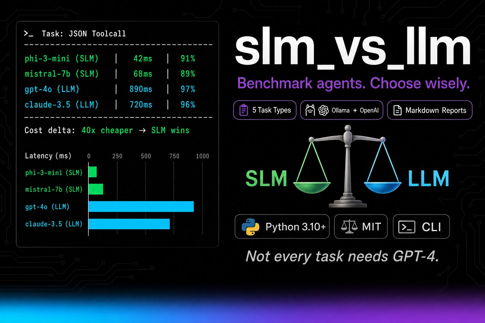

# slm_vs_llm

[](LICENSE)
[](https://python.org)
[](#)


**Not every task needs GPT-4.**

Herramienta completa para comparar modelos de lenguaje pequeños (SLM) vs modelos de lenguaje grandes (LLM) en tareas típicas de agentes. Mide **latencia**, **calidad** y **coste estimado** en distintos prompts y genera reportes reproducibles.

## 🚀 Características

- **Múltiples proveedores**: OpenAI, Hugging Face, Ollama y modo mock
- **5 tipos de tareas**: Exact QA, Math, JSON Toolcall, Classification, Reasoning
- **Métricas robustas**: Exact match, ROUGE-L, Math accuracy, JSON schema validation
- **Reportes completos**: JSON, CSV y Markdown con análisis comparativo
- **Reproducibilidad**: Semillas configurables y resultados consistentes
- **CLI intuitivo**: Comandos simples para ejecutar benchmarks

## 📋 Requisitos

- Python 3.10+
- Dependencias manejadas con `pip` o `uv`

## 🛠️ Instalación

1. **Clonar el repositorio**:
```bash
git clone <repository-url>
cd slm-llm-bench
```

2. **Instalar dependencias**:
```bash
# Con pip
pip install -e .

# O con uv (recomendado)
uv pip install -e .
```

3. **Configurar variables de entorno**:
```bash
cp env.example .env
# Editar .env con tus claves de API
```

## ⚙️ Configuración

### Variables de entorno (.env)

```bash
# OpenAI
OPENAI_API_KEY=your_openai_api_key_here

# Hugging Face
HUGGINGFACE_API_KEY=your_huggingface_api_key_here
HUGGINGFACE_ENDPOINT_URL=https://your-endpoint.huggingface.cloud

# Ollama (no requiere API key)
OLLAMA_BASE_URL=http://localhost:11434

# Configuración general
LOG_LEVEL=INFO
CACHE_ENABLED=true
TIMEOUT_SECONDS=30
```

### Configurar Ollama (para SLMs locales)

```bash
# Instalar Ollama (https://ollama.ai)
# Luego descargar modelos SLM:

# Phi-3 Mini (recomendado para SLM)
ollama pull phi3:mini

# Qwen2.5 1.5B Instruct
ollama pull qwen2.5:1.5b-instruct

# Llama 3.2 1B
ollama pull llama3.2:1b
```

## 🎯 Uso

### Comandos básicos

**Listar modelos disponibles**:
```bash
python -m bench.main list-models
```

**Listar tareas disponibles**:
```bash
python -m bench.main list-tasks
```

**Ejecutar benchmark en modo mock** (sin APIs):
```bash
python -m bench.main run --provider mock --model mock-slm --tasks core --output results.json
```

**Ejecutar benchmark con OpenAI**:
```bash
python -m bench.main run --provider openai --model gpt-4o-mini --tasks core --output results.json
```

**Ejecutar benchmark con Ollama**:
```bash
python -m bench.main run --provider ollama --model phi3:mini --tasks core --output results.json
```

**Comparar SLM vs LLM**:
```bash
python -m bench.main compare --slm mock-slm --llm mock-llm --tasks core --mock
```

### Ejemplos completos

**1. Benchmark completo con OpenAI y Ollama**:
```bash
# SLM (Ollama)
python -m bench.main run --provider ollama --model phi3:mini --tasks all --output reports/slm_results.json

# LLM (OpenAI)
python -m bench.main run --provider openai --model gpt-4o-mini --tasks all --output reports/llm_results.json

# Comparar
python -m bench.main compare --slm phi3:mini --llm gpt-4o-mini --tasks core --md-report
```

**2. Modo mock para testing**:
```bash
# Ejecutar en modo mock
python -m bench.main run --provider mock --model mock-slm --tasks all --output reports/mock_slm.json

# Comparar mock SLM vs mock LLM
python -m bench.main compare --slm mock-slm --llm mock-llm --tasks all --mock --md-report
```

## 📊 Tipos de Tareas

### 1. **exact_qa** - Preguntas y Respuestas Exactas
- **Descripción**: Tareas factuales que requieren respuestas precisas
- **Métrica primaria**: Exact match
- **Métrica secundaria**: ROUGE-L
- **Ejemplo**: "¿Cuál es la capital de Francia?" → "París"

### 2. **math** - Cálculos Matemáticos
- **Descripción**: Problemas matemáticos simples paso a paso
- **Métrica primaria**: Math accuracy
- **Métrica secundaria**: Exact match
- **Ejemplo**: "Calcula 2345 + 876" → "3221"

### 3. **json_toolcall** - Generación de JSON Estructurado
- **Descripción**: Respuestas en formato JSON válido según esquema
- **Métrica primaria**: Schema validation
- **Métrica secundaria**: Field accuracy
- **Ejemplo**: Generar JSON con nombre y edad

### 4. **classification** - Clasificación de Texto
- **Descripción**: Clasificación binaria de intenciones/sentimientos
- **Métrica primaria**: Accuracy
- **Métrica secundaria**: F1-score
- **Ejemplo**: "Me encantó el producto" → "pos"

### 5. **reason_short** - Razonamiento Breve
- **Descripción**: Respuestas de razonamiento en 3-5 frases
- **Métrica primaria**: ROUGE-L
- **Métrica secundaria**: Length control
- **Ejemplo**: Resumir ventajas de SLMs vs LLMs

## 📈 Reportes

El sistema genera tres tipos de reportes:

### 1. **JSON** - Datos completos
```json
{
  "id": "qa_1",
  "task": "exact_qa",
  "model": "phi3:mini",
  "latency_ms": 95,
  "tokens": {"prompt": 14, "completion": 3, "total": 17},
  "cost_estimate_usd": 0.00002,
  "metrics": {"exact_match": 1, "rouge_l": 0.98},
  "output": "París"
}
```

### 2. **CSV** - Para análisis
```csv
id,task,model,primary_score,secondary_1,latency_ms,total_tokens,cost_estimate
qa_1,exact_qa,phi3:mini,1.0,0.98,95,17,0.00002
```

### 3. **Markdown** - Resumen humano
- Tablas comparativas por tarea
- Análisis de trade-offs
- Conclusiones automáticas
- Recomendaciones de uso

## 🔧 Configuración Avanzada

### Añadir nuevos modelos

Editar `config/providers.yaml`:
```yaml
providers:
  openai:
    models:
      gpt-4o:
        name: "GPT-4o"
        type: llm
        pricing:
          input: 0.005
          output: 0.015
        api_key_env: OPENAI_API_KEY
```

### Añadir nuevas tareas

Editar `config/tasks.yaml`:
```yaml
tasks:
  nueva_tarea:
    name: "Nueva Tarea"
    description: "Descripción de la nueva tarea"
    primary_metric: exact_match
    secondary_metrics: [rouge_l]
    examples: 5
```

Añadir ejemplos en `data/samples.jsonl`:
```json
{"task":"nueva_tarea","id":"nt_1","prompt":"Pregunta ejemplo","gold":"Respuesta correcta"}
```

### Conjuntos de tareas personalizados

```yaml
task_sets:
  mi_conjunto:
    description: "Mi conjunto personalizado"
    tasks: [exact_qa, math, classification]
```

## 📊 Métricas y Evaluación

### Métricas implementadas

- **exact_match**: Coincidencia exacta (case-insensitive)
- **rouge_l**: ROUGE-L para similitud semántica
- **math_accuracy**: Precisión en cálculos matemáticos
- **json_schema_valid**: Validación de esquemas JSON
- **classification_metrics**: Accuracy y F1 para clasificación
- **length_control**: Control de longitud de respuesta

### Cálculo de costes

- **OpenAI**: Basado en precios por 1K tokens
- **Hugging Face**: Coste estimado si está disponible
- **Ollama**: Gratuito (coste = 0)
- **Mock**: Sin coste real

## 🚨 Limitaciones

1. **Conteo de tokens**: Para Ollama y Hugging Face se usa heurística (1 token ≈ 4 caracteres)
2. **Coste estimado**: Puede no reflejar precios reales para todos los proveedores
3. **Latencia**: Incluye tiempo de red, no solo inferencia
4. **Reproducibilidad**: Depende de la configuración del modelo y proveedor

## 🤝 Contribuir

1. Fork el repositorio
2. Crear una rama para tu feature (`git checkout -b feature/nueva-funcionalidad`)
3. Commit tus cambios (`git commit -am 'Añadir nueva funcionalidad'`)
4. Push a la rama (`git push origin feature/nueva-funcionalidad`)
5. Crear un Pull Request

## 📝 Licencia

Este proyecto está bajo la Licencia MIT. Ver `LICENSE` para más detalles.

## 🆘 Soporte

- **Issues**: Reportar bugs o solicitar features
- **Documentación**: Ver ejemplos en `data/samples.jsonl`
- **Configuración**: Revisar `config/` para personalización

---

**¡Happy benchmarking! 🚀**

---

## Metodología

Desarrollado con [HCP (Human-Code-AI Protocol)](https://github.com/haletheia/human-code-ai-protocol) — protocolo git-native para Context Engineering.
